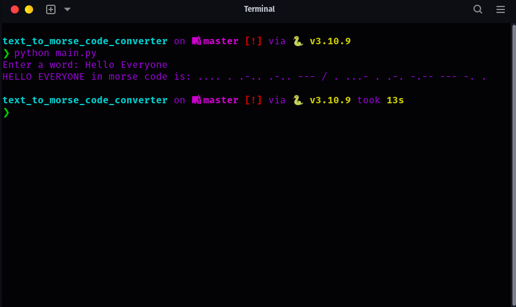

# Python Morse Code Converter

This project is a simple Python script that converts an input string into Morse code.

1. Clone the repository:
```bash
git clone https://github.com/j-breedlove/text_to_morse_code_converter.git
```
2. Change directories:
```bash
cd text_to_morse_code_converter
```
## Requirements

This project doesn't have any external dependencies and only requires Python 3.6 or higher to run.

## Usage

To run the script, use the command:

```bash
python main.py
```

You will then be prompted to enter a word. The script will convert this word into Morse code and print the output.

The Morse code mapping is defined in the `code` dictionary at the top of the script. It supports all upper-case English letters, numbers from 0 to 9, and a variety of punctuation marks.

The project also provides a function `convert_word` and a lambda function `convert_word_lambda` which take a word as input and return its Morse code representation as a string.

Example:

```python
from main import convert_word, convert_word_lambda

print(convert_word('HELLO'))  # outputs '.... . .-.. .-.. ---'
print(convert_word_lambda('WORLD'))  # outputs '.-- --- .-. .-.. -..'
```

## Error Handling

If an invalid character (a character that is not defined in the `code` dictionary) is encountered, the `convert_word` function will return the string "Invalid character in the input", and `convert_word_lambda` will replace it with a space.

## Contributing

Contributions to this project are welcome. If you find a bug or think of a feature that should be added, please open an issue. If you want to implement the feature yourself, feel free to fork the repository and open a pull request.

## License

This project is licensed under the MIT License.
